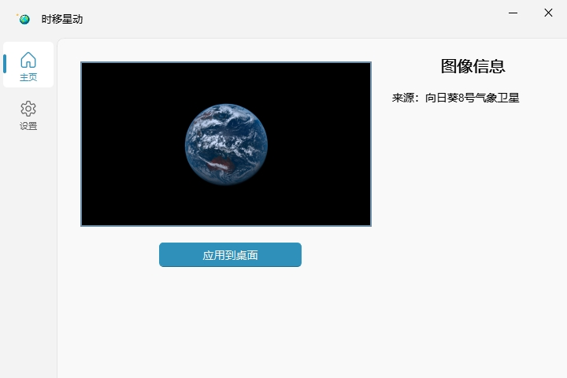
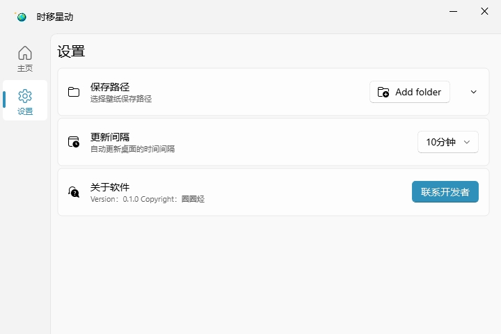
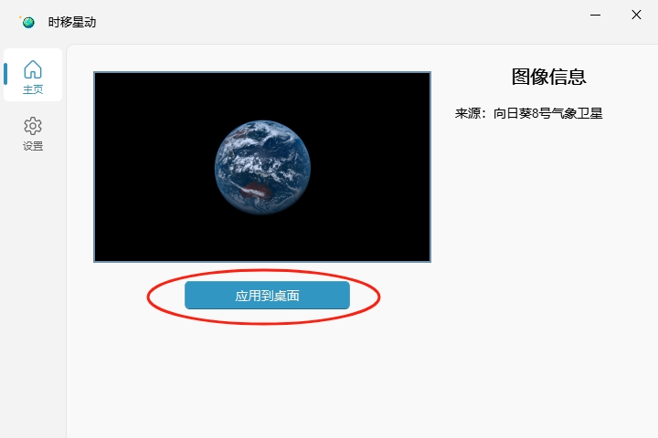

# 时移星动（PlanetOnDesk）


## 简介

**PlanetOnDesk** 旨在定时获取最新的卫星图像并将其设置为您的桌面壁纸。通过这款软件，您可以随时欣赏到地球的美丽与变化，让您的桌面焕发出无尽的生机与魅力。

## 功能特点

- **实时卫星图像**：定时获取卫星图像。
- **自动更新壁纸**：根据设定的时间间隔自动下载并更新壁纸。
- **历史图像保存**：保存下载的卫星图像，便于随时回顾和使用。

## 待开发

- [ ] 添加更多卫星图像源
- [ ] 适配各种屏幕分辨率

## 源代码安装

### 依赖

请确保您的系统已安装以下依赖：

- Python 3.9+

### 安装步骤

1. 克隆本仓库到本地：

```sh
git clone https://github.com/yourusername/PlanetOnDesk.git
cd PlanetOnDesk
```

2. 安装依赖：

 ```sh
 pip install -r requirements.txt
 ```

3. 运行程序：

```sh
python main.py
```

## 发布包安装

本软件已发布为 exe 应用程序，您可以直接下载运行`PlanetOnDesktop.exe`

## 使用说明

1. 启动软件后，您将看到主界面。
   
2. 在设置菜单中，您需要**先配置**卫星图像的更新频率、图像保存路径。
   
3. 在主页中点击“应用到桌面”按钮，此时，你可以把软件最小化，软件将开始定时获取卫星图像并更新您的桌面壁纸。
   
4. 如果需要停止更新壁纸，您直接关闭软件即可。

## 报告问题

请在 Issues 页面提交问题报告，描述问题并附上重现步骤。

## 许可证

本项目基于 [GPLv3 许可证](LICENSE)。 该项目包含使用了 GPLv3 许可的库，因此本项目整体采用 GPLv3 许可。您可以自由使用、修改和分发本项目的代码，但必须遵守 GPLv3
许可条款。详情请参见 [LICENSE](LICENSE) 文件。
